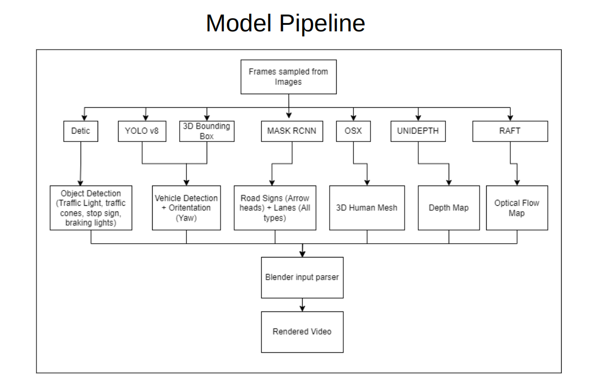
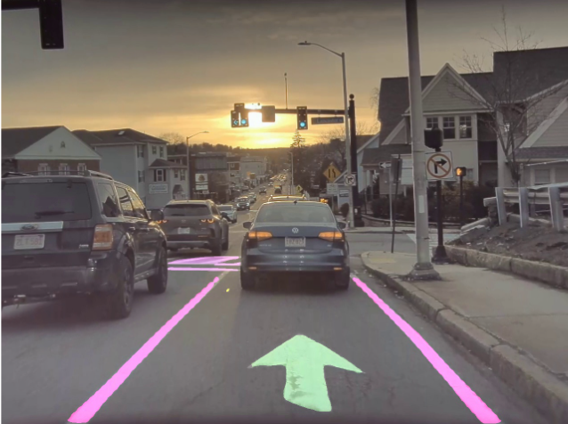
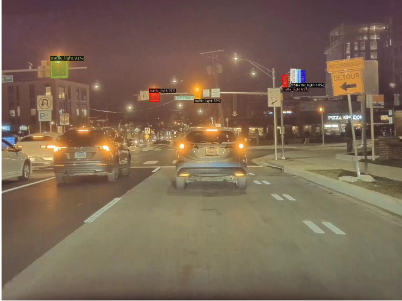
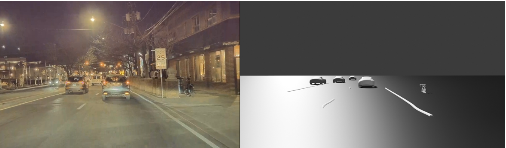
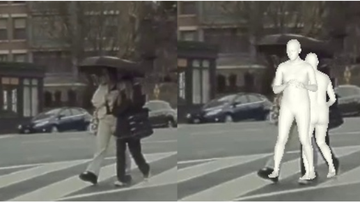
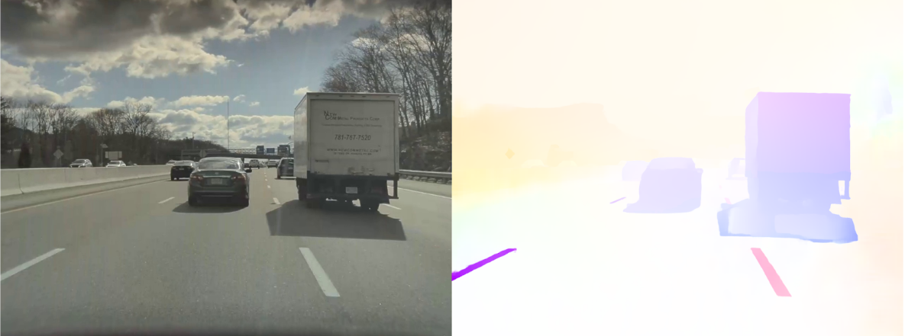

# Tesla FSD simulation

This is an attempt to simulate the Tesla FSD display. The video from front camera of Tesla is undistorted and used to detect Lanes, different Vehicles, Road Signs, Human Pose, Motion of Vehicles, Traffic Signs and more using SOTA models. The detections are then simulated in Blender. The pipeline is as follows:

 

## Results

Lane and Road Signs detection:

 

Traffic Signal detection:

 

Detection of other objects:

 

Human Pose detection:

 

Optical Flow:

 

Simulation:

 

